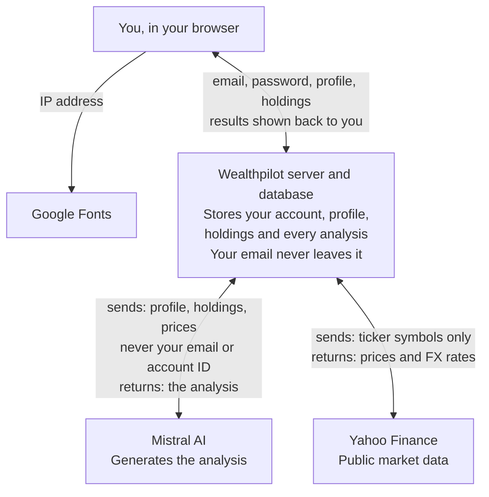

# Wealthpilot — Product Guide

Oct 4, 2026 · Lorenzo

## Welcome to Wealthpilot

Wealthpilot is a web app that helps French retail investors understand their investment portfolio and get personalised, AI-generated ideas about it. It is an information and education tool: **it never buys, sells or moves money, and it does not provide regulated financial advice.**

This guide explains, in plain language, what the app does, how each feature works and what happens to your data. It describes the current version (Phase 1 prototype).

**Wealthpilot does:**

- Ask you six questions to build your investor profile (age, income, goal, monthly budget, attitude to risk, time horizon).
- Let you record the investments you already hold elsewhere, by typing them in.
- Show what those investments are worth today, using public market prices.
- Measure how risky your portfolio is and compare that with the risk you said you are comfortable with.
- Generate three personalised recommendations, a rebalancing suggestion and a risk warning, using an AI model.

**Wealthpilot does not:**

- Connect to your bank or brokerage account. Nothing is imported automatically.
- Place orders, execute trades or hold your money or securities.
- Charge commissions or receive payments from the products it mentions.
- Replace a certified investment advisor. Every recommendation screen says so.

## Getting started

You need an email address and a password of at least 8 characters to create an account. No identity check, phone number or bank details are requested.

1. Open Wealthpilot and choose **Create an account**.
2. Enter your email and a password. You are signed in straight away.
3. Complete the six-question investor profile (next section).
4. Add the investments you hold.
5. Open your dashboard and request your first analysis.

**Signing in.** You stay signed in on that browser for 7 days, after which you are asked to log in again. **Log out** in the top bar ends the session on that device.

**Demo account.** A demo account with a completed profile and five sample investments is available from the login page, so you can explore the app without entering your own information.

**Not yet available in this version:** email verification, password reset, account deletion from within the app, and two-factor authentication.

## Your investor profile

Six questions, one per screen, tell Wealthpilot who you are as an investor. Your answers shape every recommendation, so it is worth keeping them up to date.

| # | Question | What you can answer | Why we ask |
| --- | --- | --- | --- |
| 1 | How old are you? | 18 to 100 | Younger investors usually have more time to recover from market falls. |
| 2 | What is your annual net income? | Any amount in euros | Puts the size of your investments in context. |
| 3 | What are you investing for? | Retirement, buying a home, education, growing wealth, safety net, something else | Different goals call for different levels of caution. |
| 4 | How much can you invest each month? | Any amount in euros | Lets suggestions focus on where new money should go. |
| 5 | How do you feel about risk? | 1 Very cautious to 5 Adventurous, each with a plain description | Your stated tolerance is compared with the measured risk of your portfolio. |
| 6 | When will you need this money? | 1 to 40 years | Longer horizons can absorb more ups and downs. |

The risk scale is described to you as follows: 1, "I can't accept losing money, even temporarily"; 2, "Small dips are OK if returns are steady"; 3, "I accept ups and downs for better long-term growth"; 4, "I can live with a 20–30% drop in a bad year"; 5, "I'm chasing growth and can stomach large swings".

You can change your answers at any time with **Edit profile** on the dashboard. Only the latest answers are kept.

The profile is self-declared. Wealthpilot does not check your answers, and does not ask about your investment knowledge, experience, existing debts or total wealth.

## Your portfolio

You add your investments by hand: Wealthpilot has no connection to your bank or broker. For each holding you enter three things.

| Field | What to enter | Example |
| --- | --- | --- |
| Ticker | The instrument's Yahoo Finance symbol. Paris listings end in .PA. | MC.PA (LVMH), CW8.PA (MSCI World ETF), AAPL (Apple) |
| Quantity | How many shares or units you own. Fractions are allowed. | 10 |
| Average buy price | What you paid per share, in the currency the instrument trades in. | 150 (euros for MC.PA, dollars for AAPL) |

When you type a ticker, Wealthpilot looks it up and shows the instrument's name and current price, so you can check it is the right one. You can edit or remove a holding at any time.

**How values are calculated.**

- **Prices** come from Yahoo Finance, a free public data source. They may be delayed and are refreshed at most every 5 minutes.
- **Currency.** Everything is shown in euros. Holdings priced in another currency (for example US dollars) are converted at today's exchange rate. Your gain or loss is therefore measured at today's rate, not the rate on the day you bought.
- **Gain or loss** = today's value minus what you paid (quantity × average buy price). It is before tax and fees, and is not realised until you sell.
- **Weight** = each holding's share of the total value.

**If no price is found** (a mistyped or unsupported ticker, or the data source is unavailable), the holding is shown with a NO PRICE label and valued at your buy price until a price becomes available.

## Your dashboard

The dashboard gives you a one-screen view of your portfolio: its value, how risky it is, how it is spread and what markets are doing.

- **Portfolio value**: the total value in euros, your unrealised gain or loss in euros and percent, the number of holdings and the amount invested.
- **Risk score**: a gauge from 1 to 5 showing how risky your portfolio is today, with a dashed marker for the tolerance you stated in your profile.
- **Allocation**: a bar showing what share of your money sits in each holding.
- **AI recommendations**: a summary of your latest analysis and a button to generate a new one (see next section).
- **Market context**: the latest level and daily change of the CAC 40, Euro Stoxx 50, S&P 500 and the euro–dollar exchange rate.

### How the risk score is calculated

The score measures how much your portfolio's value has moved up and down over the past year (its volatility). It takes into account how your holdings move together, so a mix of investments that don't move in step scores lower than any one of them alone.

| Label shown | Score range | Yearly swings (annualised volatility) |
| --- | --- | --- |
| Very conservative | 1.0 to 1.4 | Below 5% |
| Conservative | 1.5 to 2.4 | 5% to 9.5% |
| Balanced | 2.5 to 3.4 | 9.5% to 16% |
| Dynamic | 3.5 to 4.4 | 16% to 25% |
| Aggressive | 4.5 to 5.0 | 25% and above |

These bands loosely follow the EU's standard risk indicator used on investment product documents (the PRIIPs SRI). If a single company makes up more than 40% of your portfolio, half a point is added to reflect the extra risk of putting many eggs in one basket. Funds and ETFs are not counted as single companies.

The score describes the past. Past volatility does not predict future returns or losses.

## Recommendations

An analysis is created only when you press **Analyse** (or **Refresh / Regenerate**). It is generated by Mistral AI's large language model and is personalised using your profile and your holdings.

**What each analysis contains:**

1. **A summary**: two or three sentences assessing your portfolio against your profile.
2. **Three recommendations**, each labelled Buy, Sell, Hold or Rebalance, naming a specific instrument and explaining why.
3. **A risk flag**: the single most important risk to be aware of, rated low, medium or high.
4. **A rebalancing suggestion**: a target split of your money across asset types (for example equities, bonds and cash), in percentages.

**How it is generated.** Wealthpilot sends the AI your profile answers, your holdings and their current prices, plus fixed instructions. The instructions ask it to tailor ideas to your risk tolerance and horizon, prefer broad, low-cost funds, mention French account types (PEA, assurance-vie, compte-titres) where relevant, and present its output as educational. The answer is checked for the expected structure before it is shown; if it is malformed you see an error and nothing is saved.

**Saved analyses.** Each analysis is saved with the date it was generated and the dashboard shows the latest one. It is not updated automatically when prices or your holdings change, so refresh it after making changes.

**Demo mode.** If the AI service is not configured, Wealthpilot produces a simpler rule-based analysis instead (for example: flag a single stock above 25% of the portfolio, or a holding down more than 10%). These analyses are labelled "demo mode" on screen.

**Please keep in mind:**

- AI models can be wrong, out of date or inconsistent. Two requests on the same data may give different answers.
- The AI only knows what is described above. It does not know your tax situation, debts, other savings, or personal circumstances beyond your profile.
- Nothing is executed. Acting on any idea is your decision, through your own bank or broker.

Every screen that shows recommendations displays this notice:

> *Wealthpilot provides information and educational content only. This is not financial advice. Always consult a certified investment advisor before making investment decisions.*

## Your data

Wealthpilot stores only what you type in and the analyses it generates for you. Two outside services are used: Mistral AI, which receives your profile and holdings without your email address, and Yahoo Finance, which receives ticker symbols only.

Only an analysis request sends personal information outside Wealthpilot, and it goes to Mistral AI without your email.

| Data | Where it comes from | Where it is kept | Shared with |
| --- | --- | --- | --- |
| Email address | You, at sign-up | Wealthpilot database | No one |
| Password | You, at sign-up | Wealthpilot database, scrambled (bcrypt hash), never stored in readable form | No one |
| Investor profile: age, annual income, goal, monthly amount, risk tolerance, horizon | You, in the questionnaire | Wealthpilot database (latest answers only) | Mistral AI, when you request an analysis |
| Holdings: ticker, quantity, average buy price | You, on the Portfolio page | Wealthpilot database | Mistral AI, with current prices and values, when you request an analysis; Yahoo Finance receives the ticker symbol only |
| Analyses | Generated by Mistral AI or demo mode | Wealthpilot database, every analysis with its date | No one |
| Sign-in token | Created at login | Your browser's local storage, expires after 7 days | No one |

**What we do not collect:** your name, address, phone number, date of birth, nationality, tax number, bank or brokerage credentials, account numbers, or any payment information. There are no advertising or analytics trackers.

**Third parties.**

- **Mistral AI** (French company) processes the profile and holdings sent with each analysis request. Your email and account ID are not sent.
- **Yahoo Finance** is queried by Wealthpilot's server for prices. It receives ticker symbols, never anything that identifies you.
- **Google Fonts**: the app's typeface is loaded from Google's servers, which see your browser's IP address.

## Important information and limitations

Wealthpilot is an information and education tool, not an investment advisor, and using it does not create an advisory relationship.

- **Not financial advice.** Content is general and educational, even when it names a specific instrument. Speak to a certified investment advisor (in France, a *conseiller en investissements financiers* registered with ORIAS) before making decisions.
- **Investing involves risk.** You can lose some or all of the money you invest. Past performance and past volatility do not predict future results.
- **Data accuracy.** Prices come from a free public source and may be delayed, incomplete or wrong. Values depend on the holdings you enter: a typo in a quantity or price changes every figure.
- **AI output.** Recommendations are produced by an AI model and may contain errors, outdated information or ideas unsuitable for you. They are not reviewed by a human before you see them.
- **No tax advice.** Mentions of PEA, assurance-vie or flat-tax treatment are general. Your tax situation may differ.
- **No execution.** Wealthpilot never places orders. Any transaction is made by you, through your own provider, at your own discretion.
- **Prototype.** This is an early version. Features, calculations and wording may change.

## Frequently asked questions

**Can Wealthpilot buy or sell for me?**
No. It only reads the information you enter and suggests ideas. You make any trade yourself, with your own bank or broker.

**Does Wealthpilot connect to my bank or broker?**
No. You type in your holdings. Nothing is imported and no login details for other services are requested.

**Is Wealthpilot paid to recommend certain products?**
No. It receives no commissions or payments from the instruments it mentions.

**Why does my risk score differ from the risk tolerance I chose?**
The tolerance is what you told us you are comfortable with. The score measures how your actual holdings have behaved over the past year. A gap between the two is exactly what the analysis helps you think about.

**Why did my recommendations change?**
Each new analysis uses the latest prices and your current profile and holdings, and AI models do not always give the same answer twice.

**My ticker shows NO PRICE. What should I do?**
Check the symbol on Yahoo Finance; Paris listings end in .PA, Amsterdam in .AS. The holding is valued at your buy price until a price is found.

**Who sees my information?**
Only you, through your account. Your profile and holdings are sent to Mistral AI when you ask for an analysis, without your email address. See *Your data*.

**How do I delete my account?**
Account deletion is not yet available in the app. Contact the Wealthpilot team to request it.

## Appendix: notes for legal review

This appendix is internal, not customer-facing. It sets out how the current build behaves, as verified in the code.

### How the current build behaves

| Area | Current behaviour |
| --- | --- |
| Output | Three recommendations per analysis, each with an action (buy, sell, hold, rebalance), a named ticker and a rationale; a target allocation in percent; a risk flag. |
| Personalisation | Based on the six self-declared profile answers, the holdings and live prices. |
| Human review | None. AI output is checked only for format, then shown and stored. |
| AI provider | Mistral AI API, model mistral-large-latest, called from the server. The request has no email or user ID. |
| AI instructions | Tells the model it is an educational assistant, not to present output as regulated advice, to prefer diversified low-cost UCITS ETFs, and to mention PEA, assurance-vie and compte-titres where relevant. |
| Labelling | The disclaimer is shown on the dashboard recommendations panel and twice on the Recommendations page. The page says "Generated by Mistral AI" or "Demo mode". |
| Demo mode | Rule-based text used when no AI key is set. It includes tax statements (PEA treatment after 5 years, 30% flat tax outside a PEA). |
| Sign-up | Email and password only. No terms of service, privacy notice or consent step. No age check at sign-up; the profile only accepts ages 18 to 100. |
| Retention | Profile, holdings and every analysis kept indefinitely. No in-app deletion or export. |
| Logs | Web server access logs record IP addresses and request paths. |
| Hosting | Not yet decided (prototype runs locally). |
