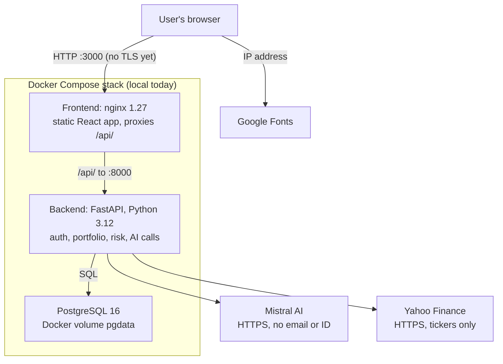
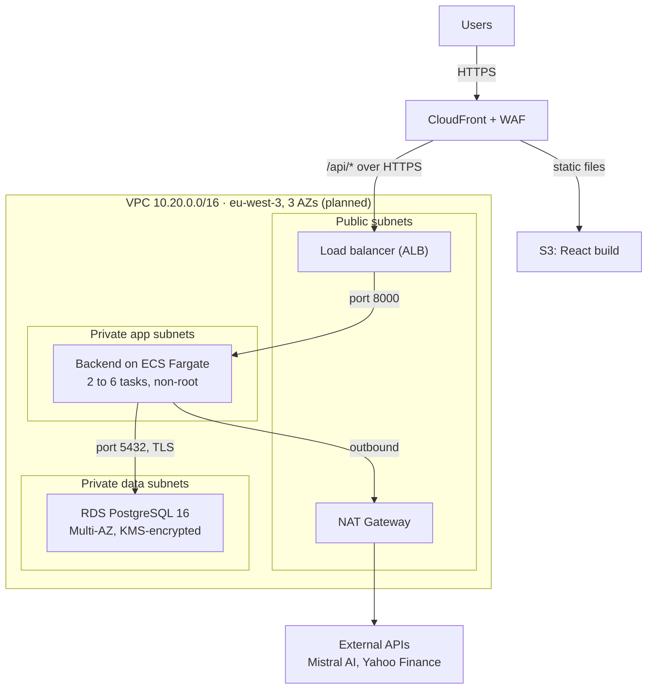

# Wealthpilot — Technical Architecture

Oct 4, 2026 · Lorenzo

## Overview

Wealthpilot is a React frontend, a FastAPI backend and a PostgreSQL database, run together with Docker Compose. It currently runs on a developer machine. Code: GitHub `Artifacts7/FinTechProto` (private), branch `main`.

## Architecture

The browser reaches the app through nginx, which serves the React build and forwards API calls to the FastAPI backend. Only the backend talks to Postgres and to external services.

The backend's port 8000 is also published to the host, so the API can be reached directly without going through nginx; the database port is not published.

## Technology stack

Three containers, defined in `docker-compose.yml`: a static frontend behind nginx, a Python API, and PostgreSQL.

| Component | Technology | Version | Runs as |
| --- | --- | --- | --- |
| Frontend | React, React Router, Tailwind CSS, built with Vite | React 18.3, Router 6.30, Tailwind 4.3, Vite 6.4 | Static files served by nginx 1.27-alpine; built in a node:22-alpine stage |
| Reverse proxy | nginx | 1.27-alpine | Serves the app and forwards `/api/` to the backend container |
| Backend API | FastAPI on Uvicorn, Python | FastAPI 0.115.6, Uvicorn 0.34.0, Python 3.12-slim | Single Uvicorn process, container user root |
| ORM and driver | SQLAlchemy, psycopg | 2.0.36, 3.2.3 | In the backend process |
| Validation | Pydantic (with email-validator) | 2.10.4 | Request and AI-response schemas |
| Auth libraries | PyJWT, bcrypt | 2.10.1, 4.2.1 | In the backend process |
| HTTP client | httpx | 0.28.1 | Calls to Mistral AI |
| Market data | yfinance (unofficial Yahoo Finance client) | 1.7.0 | In the backend process, 5-minute in-memory cache |
| Database | PostgreSQL | 16-alpine | Docker named volume `pgdata` |

Python dependencies are pinned in `backend/requirements.txt`. Frontend dependencies are locked in `frontend/package-lock.json`.

## Data model

Four tables, all keyed to a user. The schema is created by SQLAlchemy `create_all` when the app starts; there are no migrations.

| Table | Fields | Notes |
| --- | --- | --- |
| `users` | id, email (unique), password_hash, created_at | Email stored lower-cased; password as bcrypt hash |
| `risk_profiles` | user_id (unique), age, annual_income, savings_goal, monthly_investment, risk_tolerance (1–5), horizon_years, updated_at | One row per user, overwritten on edit |
| `holdings` | id, user_id, ticker, quantity, avg_buy_price | Buy price in the instrument's trading currency |
| `recommendations` | id, user_id, payload (JSON), source (`mistral` or `demo`), created_at | One row per generated analysis; latest shown in the UI |

- `users` cascades to `risk_profiles` and `holdings` at ORM level; `recommendations` reference `user_id` with no ORM relationship.
- On every backend start, `seed.py` creates the demo user `demo@wealthpilot.fr` with 5 holdings if it does not exist.

## External services and data flows

Three external services are contacted. Only Mistral AI receives personal data, and only when a user asks for an analysis.

| Service | Called from | When | Data sent | Transport |
| --- | --- | --- | --- | --- |
| Mistral AI (`api.mistral.ai/v1/chat/completions`, model `mistral-large-latest`) | Backend | On `POST /api/recommendations` | Profile fields, holdings with prices, values, weights and P&L, system instructions. No email or user ID. | HTTPS, bearer API key, 60 s timeout, JSON response mode |
| Yahoo Finance (via yfinance) | Backend | Portfolio views, ticker lookups, market panel; cached 5 min per symbol in process memory | Ticker symbols and FX pairs | HTTPS |
| Google Fonts | User's browser | Page load | Standard font request | HTTPS |

- Mistral network errors or responses that fail schema validation return HTTP 502 and nothing is stored.
- With `MISTRAL_API_KEY` empty, the backend uses a local rule-based generator and stores the result with source `demo`.

## Authentication and authorisation

Users sign in with email and password and receive a signed token valid for 7 days. Every data endpoint looks records up through the signed-in user, so one user cannot read or change another's data.

| Aspect | Implementation |
| --- | --- |
| Password storage | bcrypt, default cost (12 rounds), per-password salt |
| Password rules | 8–128 characters |
| Email | Format-validated, lower-cased, unique |
| Token | JWT, HS256, signed with `JWT_SECRET`; claims `sub` (user ID) and `exp` (7 days) |
| Token on the client | Stored in browser `localStorage`, sent as `Authorization: Bearer` |
| Logout | Clears the token in the browser |
| `JWT_SECRET` | Required, at least 32 bytes; no default. The backend refuses to start without it, except with `APP_ENV=dev`, which uses a random per-process secret |
| Account deletion | `DELETE /api/auth/me` with the password; erases the user, profile, holdings and recommendations |
| Data access | Profile, holdings and recommendations are read and written through the authenticated user; holding updates and deletes check ownership and return 404 otherwise |
| Roles | One user type; no admin interface |

## Network, secrets and logging

| Area | How it works |
| --- | --- |
| Ports | Host 3000 → nginx :80; host 8000 → backend :8000; Postgres :5432 internal to the Compose network only |
| Protocols | HTTP between browser and nginx and between containers; HTTPS for calls to Mistral and Yahoo |
| Routing | nginx serves the built React app and proxies `/api/` to `backend:8000` with a 90 s read timeout; other paths fall back to `index.html` |
| CORS | Backend allows `http://localhost:5173` (Vite dev server) |
| API docs | FastAPI's `/docs` and `/openapi.json` enabled |
| Secrets | `MISTRAL_API_KEY`, `JWT_SECRET`, `DATABASE_URL` from environment or optional `.env` (git-ignored); Postgres user and password set in `docker-compose.yml` |
| Database storage | Docker named volume `pgdata` on the host |
| Request validation | Pydantic schemas on all request bodies (types, ranges, enumerations) |
| Database queries | SQLAlchemy ORM |
| AI output | Parsed into a strict Pydantic schema before storing or rendering; rendered as text by React |
| Logging | Uvicorn and nginx access logs plus Python `logging` at INFO, all to container stdout |
| Container user | Backend runs as root in `python:3.12-slim` |

## Runtime and deployment

`docker compose up --build` builds and starts three services on one default bridge network:

| Service | Image / build | Startup | Health and ordering |
| --- | --- | --- | --- |
| `db` | `postgres:16-alpine` | Creates database `wealthpilot` on first run | `pg_isready` every 3 s, up to 20 retries |
| `backend` | Built from `backend/Dockerfile` on `python:3.12-slim` | Runs `python seed.py`, then `uvicorn app.main:app --host 0.0.0.0 --port 8000`; tables created at import | Starts after `db` is healthy |
| `frontend` | Multi-stage: `node:22-alpine` runs `npm ci` and `vite build`, output copied into `nginx:1.27-alpine` | nginx with `frontend/nginx.conf` | Starts after `backend` |

The app currently runs on a developer machine only. There is no hosted environment, CI pipeline or deployment automation.

## Development

One private GitHub repository, one branch.

| Area | How it works |
| --- | --- |
| Repository | GitHub `Artifacts7/FinTechProto`, private, branch `main` |
| Workflow | Commits pushed directly to `main` |
| Builds | Local, via Docker Compose |
| Tests | Manual: API calls, scripted browser walkthrough, mocked Mistral response |
| Dependencies | Python pinned in `backend/requirements.txt`; JS locked in `frontend/package-lock.json` |
| Schema changes | SQLAlchemy `create_all` at startup |
| Config | `.env.example` committed; `.env` git-ignored |
| Docs | `README.md`, `docs/PRODUCT_GUIDE.md`, this document |

## Target production deployment (planned, not yet built)

> **Planned design. None of the infrastructure in this section exists yet.** Everything above describes the system as it runs today. Update this section to match what is actually provisioned before relying on it.

Production runs on AWS in `eu-west-3` (Paris), spread across three availability zones. The containers built today are reused unchanged: the backend image runs on ECS Fargate, the frontend build is served from S3 through CloudFront, and Postgres moves to RDS. Everything is defined in Terraform in a separate `wealthpilot-infra` repository.

Requests enter through CloudFront only. The backend sits in private subnets and reaches external APIs through NAT, and the database accepts connections from the backend alone.

### Components

| Layer | AWS service | Configuration |
| --- | --- | --- |
| DNS | Route 53 | `wealthpilot.fr` apex and `app.` / `api.` records |
| Edge and frontend | CloudFront + S3 | React build in a private S3 bucket (Origin Access Control); CloudFront serves it over HTTPS with an ACM certificate and routes `/api/*` to the load balancer |
| Web firewall | AWS WAF on CloudFront | AWS managed core rule set; rate limit of 100 requests per 5 minutes per IP on `/api/auth/*` |
| Load balancer | Application Load Balancer | Public subnets, HTTPS only (TLS 1.2+), ACM certificate, accepts traffic from CloudFront only |
| Backend | ECS Fargate | Backend image from ECR; 2 tasks minimum, 6 maximum, 0.5 vCPU / 1 GB each, scaling at 60% CPU; private subnets; runs as a non-root user |
| Database | RDS for PostgreSQL 16 | `db.t4g.medium`, Multi-AZ, 50 GB gp3, private subnets, TLS required for connections |
| Outbound traffic | NAT Gateway | One per AZ; backend reaches Mistral and Yahoo through it |
| Container registry | ECR | Image scanning on push; images tagged by git SHA |

### Network

| Item | Configuration |
| --- | --- |
| VPC | `10.20.0.0/16`, 3 AZs |
| Public subnets | ALB and NAT Gateways only |
| Private app subnets | ECS tasks; no public IPs |
| Private data subnets | RDS only; no route to the internet |
| Security groups | ALB accepts 443 from the CloudFront managed prefix list. ECS accepts 8000 from the ALB only. RDS accepts 5432 from the ECS security group only. |
| Interactive API docs | `/docs` and `/openapi.json` disabled in production |

### Data storage and secrets

| Item | Configuration |
| --- | --- |
| Database encryption | RDS storage encrypted with a customer-managed KMS key |
| S3 encryption | SSE-S3; public access blocked at account level |
| Secrets | `JWT_SECRET`, `MISTRAL_API_KEY` and database credentials in AWS Secrets Manager, injected into ECS tasks at start; RDS credentials rotated every 30 days |
| Data residency | All storage and compute in `eu-west-3`; analysis requests go to Mistral AI's EU API endpoint |

### Environments and accounts

| Environment | AWS account | Purpose | Data |
| --- | --- | --- | --- |
| Production | `wealthpilot-prod` | Live service | Real user data |
| Staging | `wealthpilot-staging` | Pre-release testing; same Terraform modules, smaller sizes (1 ECS task, single-AZ RDS) | Seed and synthetic data only |
| Development | Developer machines | Docker Compose as described above | Demo user only |

Accounts sit under one AWS Organization, with CloudTrail enabled organisation-wide and logs sent to a separate `wealthpilot-audit` account.

### CI/CD

1. Pull request to `main` triggers GitHub Actions: lint, backend tests, frontend build, Docker build, and Trivy scan of the image.
2. Merge to `main` (one approving review required) pushes the image to ECR tagged with the commit SHA, uploads the frontend build to the staging S3 bucket, and deploys to staging.
3. A manual approval in the GitHub `production` environment promotes the same image and frontend build to production. ECS rolls out with a circuit breaker that rolls back on failed health checks.
4. GitHub authenticates to AWS with OIDC role assumption; no long-lived AWS keys are stored in GitHub.
5. Database schema changes run as Alembic migrations in a one-off ECS task before the new backend version starts.

### Access

| Who | How | Scope |
| --- | --- | --- |
| Engineers | AWS IAM Identity Center with MFA, linked to Google Workspace | Read-only in production by default; time-limited admin role with approval |
| Database access | SSM Session Manager port forwarding through an ECS task; no bastion host or public endpoint | Session logs to CloudWatch |
| CI | GitHub OIDC role | Push to ECR, update ECS services, write to frontend S3 bucket |

### Backups and recovery

| Item | Configuration |
| --- | --- |
| RDS automated backups | Daily, 14-day retention, point-in-time recovery |
| Snapshot copies | Daily copy to `eu-west-1` (Ireland), 30-day retention |
| Targets | RPO 5 minutes, RTO 4 hours |
| Restore test | Quarterly restore into staging |

### Monitoring and logging

| Item | Configuration |
| --- | --- |
| Application logs | ECS tasks log to CloudWatch Logs as JSON; 90-day retention, then archived to S3 for 1 year |
| Load balancer and CloudFront logs | Delivered to an S3 log bucket in the audit account |
| Metrics and alarms | CloudWatch alarms on ALB 5xx rate > 2%, p95 latency > 2 s, ECS running tasks < 2, RDS CPU > 80%, RDS free storage < 10 GB, Mistral error rate > 10% |
| Alerting | Alarms go to an SNS topic, which posts to Slack `#wealthpilot-alerts` and pages the on-call engineer |
| Uptime check | Route 53 health check on `/api/health` every 30 s |
